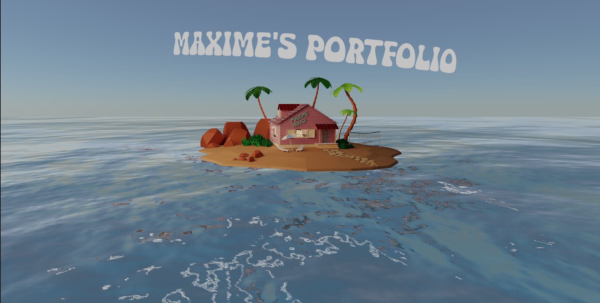

# Akshit's 3D Portfolio

### Welcome to my portfolio

Hi everyone, thanks for being here.

I am Akshit Jain, a computer science enthusiast. This portfolio showcases my skills and projects in an immersive 3D environment.

Some details about this project:

This project is built with React Three Fiber, utilizing helpers from Drei. The camera animations are powered by GSAP, and the shaders are written with GLSL. The 3D house model was created in Blender.

If you notice any bugs or have questions, please contact me at gang.akshitjain@gmail.com.

**Go live :** https://akshitjain16.github.io/KameHousePortfolio/
